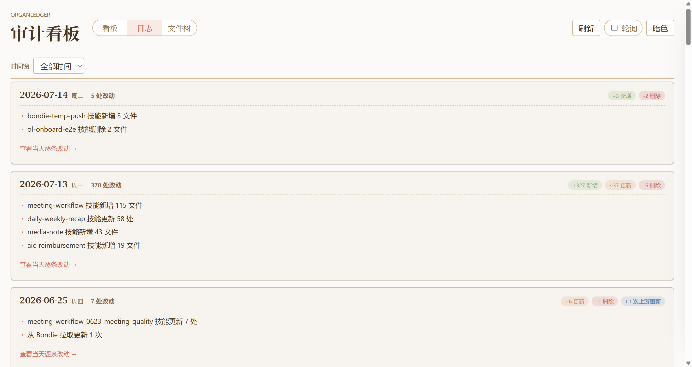

# OrganLedger 智能体变更审计

> Agent 改了自己的技能、任务、记忆或流程之后，你怎么知道**发生了什么、风险在哪、下一步怎么办**？OrganLedger 把这些改动记录下来，整理成一眼能看懂的**看板 / 日志 / 文件树**。

OrganLedger 不是另一个 Agent，也不是编辑器插件，而是一个**旁挂的“变更审计台”**。OpenClaw、Hermes 或其他 Agent 系统照常工作；OrganLedger 只负责把它们对关键“器官文件”（技能 / 任务 / 记忆 / 流程 / 配置）的每次改动记录下来，让你能复盘、能追责、能放心。


---

## 为什么需要它

Agent 越来越会“自我修改”——自动更新技能、改计划任务、写记忆、拉上游更新。方便，但也意味着：

- 你不知道**昨晚它悄悄改了什么**。
- 一个高风险改动（比如删掉一个技能、改了 cron）混在一堆日志里，**没人看得见**。
- 出了问题想复盘，只能翻散落的终端日志和 git log，**读不动**。

OrganLedger 把“不可读的变更流水”变成“**用户能看懂的证据**”。它的原则很克制：**能确认的才说，不能证明的明确标未知**——能验证来源就标来源，能归因主使就显示主使，绝不替你猜真相。

## 你能用它做什么

- 看到最近有哪些器官文件被改动，哪些是**高风险 / 删除 / 待确认**。
- 分清一个改动来自**本地修改、上游更新，还是某个外部请求**。
- 按日期**复盘某一天**发生了什么，而不用翻日志。
- 用热力图找到**改动最集中的目录和文件**。
- 一键**复制简报**，把可疑变更交给终端或 Coding Agent 深入排查。
- 高风险改动（如删除）会被**治理门扣住等你批准**，账本用 **SHA256 哈希链**防篡改、跨平台可校验。

---

## 三个页面，三种视角

### 🗂 看板 · “现在有没有值得我关注的”

一屏概览：改动数、涉及文件、严重度、涉及系统，以及每个器官仓库的来源（remote / 分支 / 上游差多少）。点任意一条变更，右侧滑出详情抽屉——状态、操作、before/after 哈希、git commit、时间一应俱全。**看板只读**：需要处置时给你可复制的命令，处置权始终在你手里。

### 📆 日志 · “某一天到底发生了什么”

把新增 / 更新 / 删除 / 上游同步按天聚合成一份**自动生成的日记**。哪天改得多、改在哪、是什么类型，一目了然。



展开当天明细，还能**一键复制简报给 Coding Agent**。日志页只显示“发生了什么、在哪”，**不摊开文件正文或密钥**，可以放心截图沟通。


### 🌡 文件树 · “改动集中在哪个区域”

把器官目录画成一棵可展开的树，**颜色越深 = 改动越多**。像一张热力地图，先看热点在哪，再逐层下钻。


支持“只看改动”聚焦排查、“打码”隐藏敏感文件名后安全分享，以及右键跳回本机资源管理器 / 访达。


> 📖 **完整图文使用指南**：[`docs/walkthrough/`](docs/walkthrough/README.md) —— 每个页面怎么看、怎么用、推荐排查顺序。

---

## 几个核心概念

| 概念 | 是什么 | 回答的问题 |
|------|--------|-----------|
| **变更记录** | 每次器官文件变化整理成一条记录（路径 / 操作 / 时间 / 严重度 / 状态 / 证据） | 改了什么 |
| **来源** | 这个器官来自哪个 remote / 分支 / commit | 它从哪来 |
| **主使** | 这次改动可能由谁的请求触发（IM 用户 / 本机 / Agent 自主 / 未知） | 谁触发的 |
| **只读看板** | 只展示和组织证据，不直接改账本或 git；处置给可复制命令 | 我该怎么办 |

> **诚实是底线**：只有接入对应入口并满足认证条件时，主使才显示“已认证”；来源能验证才标已验证；证明不了的一律标未知 / 未验证。OrganLedger 宁可说“不知道”，也不硬猜。

---

## 快速开始

需要 **Node ≥ 24**（无需构建步骤）。

```bash
# 1) 安装依赖 + CLI 命令
npm install && npm link          # 之后全局用 organledger

# 2) 一键初始化 —— 探测你的 OpenClaw/Hermes、生成配置、回填历史、预热看板
organledger init

# 3) 开始治理（后台常驻，Agent 一改器官文件就自动记账）
organledger daemon

# 4) 打开审计看板
organledger dashboard --open      # http://localhost:7377
```

装好后即有纵深：`init` 会把目标仓库的 **git 历史回填成变更记录**，看板首开就有内容，不是空的。

> 完整命令、参数、架构与数据契约见 **[`ENGINEER-README.md`](ENGINEER-README.md)**；本机实测 / 贡献指南见 **[`DEV-README.md`](DEV-README.md)**。

---

## 跨平台

Windows / macOS / Linux 行为一致、账本哈希链跨平台不断裂（LF 钉行尾、CRLF 容错、Windows 优雅关闭、macOS 符号链接路径修复、CI 三平台矩阵）。详见 [`ENGINEER-README.md` 跨平台兼容性一节](ENGINEER-README.md)。

## 文档地图

| 想了解 | 看这里 |
|--------|--------|
| 产品是什么、能干什么（本文件） | `README.md` |
| 图文使用指南（每个页面怎么用） | [`docs/walkthrough/`](docs/walkthrough/README.md) |
| 完整命令 / 架构 / 数据契约 / 身份归因 | [`ENGINEER-README.md`](ENGINEER-README.md) |
| 本机实测 / 数据隔离 / 贡献陷阱 | [`DEV-README.md`](DEV-README.md) |
