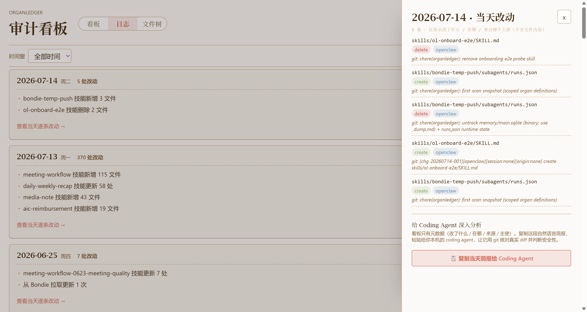
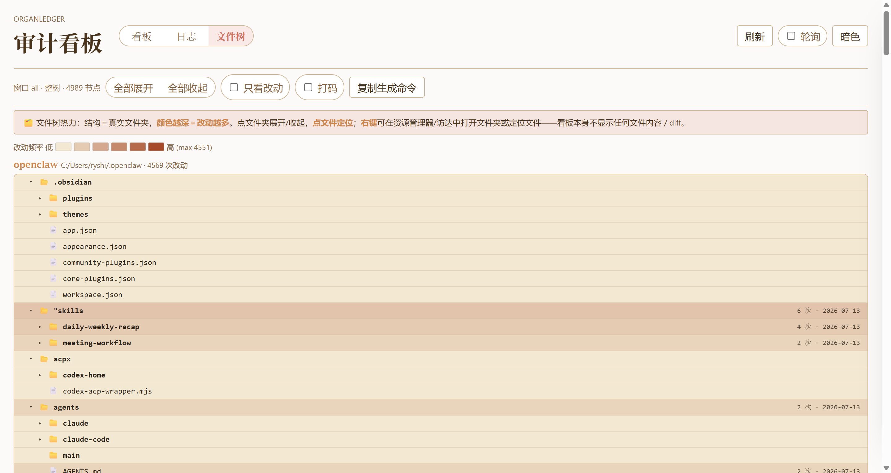

# OrganLedger 智能体变更审计

OrganLedger 是给 AI Agent 自我变更准备的本地审计台。

当 Agent 修改自己的技能、任务、记忆、流程或其他关键文件时，OrganLedger 帮你把这些变化整理成可以理解、可以复盘、可以继续追问的线索。它不要求普通用户读代码，也不把复杂实现暴露在第一屏。你只需要知道：最近发生了什么、哪里值得关注、下一步应该回到哪里处理。

这份 README 面向不准备改代码的使用者，重点解释产品设计和使用路径。面向维护者的完整说明请看 [engineer-readme.md](engineer-readme.md)。完整新手引导请看 [docs/newbie-guide.md](docs/newbie-guide.md)。

## 它为什么存在

Agent 越能干，越会接触自己的“器官文件”：技能、调度、记忆、工作流、身份线索和团队约定。问题也随之出现：

- 改动散在不同目录里，很难一眼看懂。
- 文件有变化，但不知道是本地行为、上游同步，还是外部请求触发。
- 删除、高风险目录、密集改动等信号容易被普通文件列表淹没。
- 复盘时经常只能翻终端、翻文件、翻聊天记录，成本很高。
- 分享给同事时，又不希望直接暴露敏感文件内容。

OrganLedger 的目标是把这些变化变成一条用户能读懂的审计路径：先看见，再判断，再回到本机做深入处理。

## 你可以用它完成什么

- 快速知道最近哪些 Agent 器官发生了变化。
- 按日期复盘某一天的改动节奏和集中区域。
- 找到变化最密集的目录或文件。
- 识别删除、高严重度、来源不清等更值得关注的线索。
- 在不暴露文件正文的情况下截图、分享、沟通。
- 把整理好的简报交给 Coding Agent 或同事继续分析。

OrganLedger 不替你下结论。它负责把证据摆清楚，把不确定的地方说清楚，让你更快进入正确的判断位置。

## 一眼看懂

活动日志把变化按日期排好，让你先回答“最近哪一天最值得回看”。

进入某一天后，右侧会展示当天的逐条明细。你可以看到变化集中在哪些文件和系统里，再决定是否继续深入。

文件树把目录画成地图。颜色越深，说明这一片越活跃。它适合回答“这轮变化主要落在哪里”。

需要截图或对外沟通时，可以使用打码视图，只保留结构和热度，不暴露敏感路径名。

## 推荐使用路径

1. 先看活动日志，找到最近变化最集中的日期。
2. 打开当天明细，确认变化类型、涉及文件和来源线索。
3. 切到文件树，看热点是否集中在高敏感目录。
4. 如果需要继续判断，复制当天简报交给 Coding Agent 或同事。
5. 回到本机文件、编辑器或版本工具里查看真实内容并处理。

这条路径适合日常巡检，也适合在“我不确定 Agent 刚才改了什么”的时候快速恢复上下文。

## 核心设计

### 审计的是“器官文件”

OrganLedger 关注的是 Agent 系统赖以运行和自我调整的关键文件，而不是普通项目里的所有文件。这样做的好处是减少噪音，让用户优先看到真正影响 Agent 行为的变化。

### 先给线索，不假装全知

页面里会展示来源和主使线索，但不会把无法证明的身份说成确定事实。例如，本机变化可能来自你本人、Coding Agent 或其他本机进程。OrganLedger 会告诉你“目前能确认到哪里”，把判断权留给用户。

### 看板不展示敏感正文

OrganLedger 的页面用于审计和导航，不直接展示文件正文。这样你可以放心截图、分享和复盘。需要查看真实内容时，再回到本机工具继续处理。

### 文件树是地图，不是编辑器

文件树的价值是让你看见改动热点和目录结构。它帮助你定位问题，不替代编辑器，也不替代深入分析。

## 三个主要页面

### 看板

看板用于快速建立整体感：最近有没有异常变化，哪些系统更活跃，哪些线索需要继续追踪。它适合做第一眼巡检。

### 活动日志

活动日志用于按日期复盘。它把分散的变化收拢成一条时间线，让你看到一天之内发生了什么、集中在哪里、是否需要进一步处理。

### 文件树

文件树用于定位热点。它把文件夹和文件以层级方式展开，并用热度帮助你找到最值得关注的位置。

## 什么时候应该重点关注

- 某一天的改动突然变多。
- 删除类变化出现在关键目录。
- 高严重度变化集中出现。
- 来源线索和你的预期不一致。
- 文件树里某个敏感目录颜色明显更深。
- 你准备把 Agent 的近期变化同步给团队。

这些情况不一定代表问题，但都值得继续看一眼。

## 产品边界

OrganLedger 是审计台，不是权限系统。

它不会替你阻止所有风险，也不会替你判断每一次变化是否正确。它做的是把变化整理成可读线索，让你更早看见异常，更容易复盘，更方便把上下文交给真正处理问题的人或工具。

如果你负责维护、接入或二次开发，请从 [engineer-readme.md](engineer-readme.md) 开始。若你只是第一次了解这个产品，请继续读 [docs/newbie-guide.md](docs/newbie-guide.md)。
