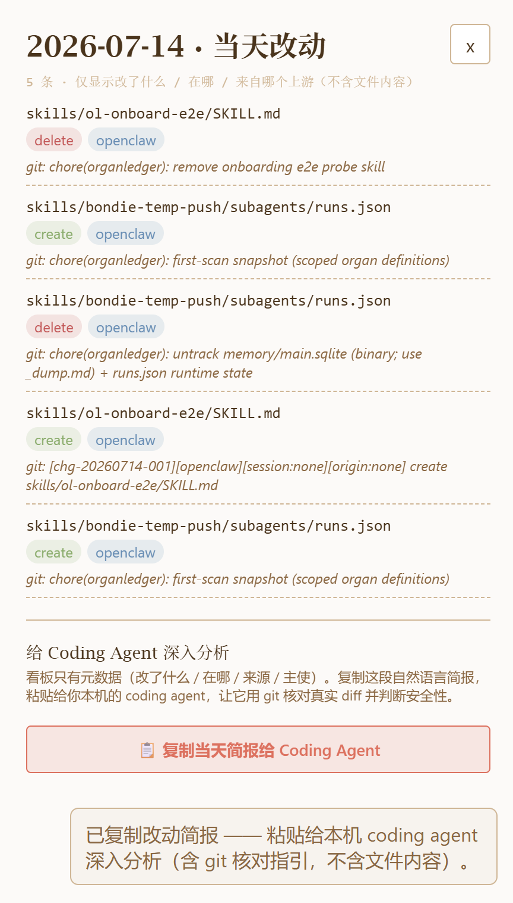
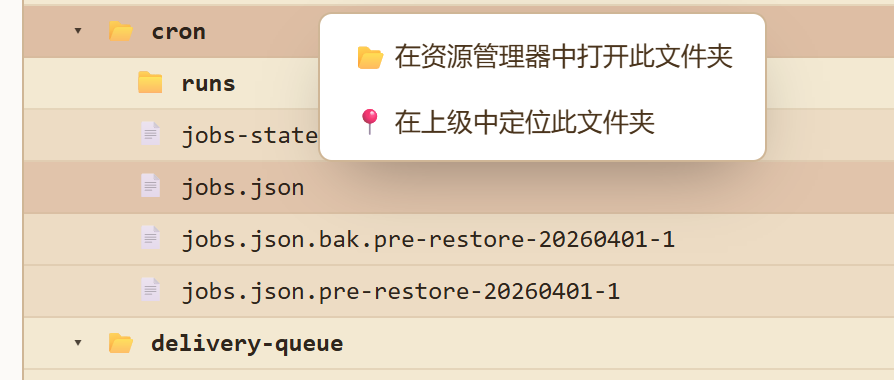

# OrganLedger 新手村手册

欢迎来到 OrganLedger 的新手村。

如果你第一次打开这个项目，先不要急着理解所有命令、账本字段或实现细节。OrganLedger 最重要的作用很简单：当 Agent 修改自己的技能、任务、记忆或流程时，帮你看见“发生了什么、风险在哪里、下一步该怎么处理”。

它不是另一个 Agent，也不是编辑器插件。它更像一个旁挂的变更审计台：OpenClaw、Hermes 或其他 Agent 系统继续工作；OrganLedger 负责把关键器官文件的改动整理成可读的看板、日志和文件树。

## 1. 你先要知道它解决什么问题

Agent 会越来越多地修改自己的“器官”：skills、agents、cron、memory、flows。没有 OrganLedger 时，这些变化常常是散落的：有的藏在 git 里，有的只留下文件时间，有的很难知道是不是上游同步，有的更难知道是不是某个外部请求触发。

OrganLedger 把这些变化收拢成一条用户能读懂的路径：

- 看见最近有哪些器官文件被改动。
- 发现高风险、删除操作或异常变化。
- 分清改动更像是本地变化、上游更新，还是某个已接入请求触发。
- 按日期复盘，而不是翻散落日志。
- 找到最活跃的目录和文件，再回到本机工具里看真实内容。
- 需要深入判断时，把整理好的简报交给 Coding Agent 或终端。

它的产品原则是：能确认的证据摆清楚，不能证明的部分不硬猜。

## 2. 打开新手村入口

日常使用通常从看板开始：

```bash
organledger dashboard --open
```

首次安装时，请先按 README 的快速开始完成 `npm install`、`npm link`、`organledger init` 和 `organledger daemon`。看板打开后，你会看到三个主页面：

- 看板：现在有没有值得我关注的改动？
- 日志：某一天到底发生了什么？
- 文件树：改动集中在哪些目录或文件？

第一次打开时，建议按这个顺序走：

1. 先看“看板”的概览数字，判断最近变化是否异常。
2. 用筛选把注意力收窄到某个系统、严重度、来源或主使线索。
3. 切到“日志”，按日期复盘近期变化。
4. 切到“文件树”，看改动热点在哪里。
5. 对可疑记录复制简报，交给 Coding Agent 或回到本机 git / 编辑器继续判断。

## 3. 第一站：看板页

看板页是主工作台。它把分散的文件改动整理成一屏概览，让你先判断“最近有没有异常变化”，再决定要不要去日志或文件树里继续看。

顶部概览区像一个仪表盘：

- 改动数：当前时间范围内记录到的变化数量。
- 涉及文件：这批变化影响了多少文件。
- 严重度：帮助你优先关注 high 或 critical。
- 系统：区分变化来自 OpenClaw、Hermes 或其他目标。

这个区域的目的不是展示更多数据，而是让你几秒内知道：今天的器官变化是否平静，还是需要继续追踪。


### 用筛选把注意力收窄

筛选栏是看板页的聚焦器。当记录很多时，不需要从头翻到尾，可以直接按你的问题筛。

常见用法：

- 想看最近状况：保留“近 7 天”。
- 想查历史：切到“全部”。
- 想只看高风险：把严重度切到 high 或 critical。
- 想分清来路：选择“上游更新”或“本地改动”。
- 想看触发线索：按“修改者”筛 IM 用户请求、agent 自主、本机或未知。
- 已经知道文件名：直接搜索路径片段或 change id。

这里的“修改者”更准确地说是“主使线索”。如果显示本机，意思是 OrganLedger 知道变化来自这台机器，但不会武断区分是你本人、Coding Agent，还是其他本机进程。

## 4. 第二站：日志页

日志页把器官变化翻译成按日期排列的活动时间线。它面向复盘场景：你不一定要立刻处理某条记录，只是想知道最近 Agent 系统在自己的器官上发生了什么。

相比看板页，日志页更像一份自动生成的日记。它把新增、更新、删除、上游同步等动作按天聚合，让非工程视角也能读懂变化节奏。


每个日期卡片都在回答三个问题：

- 这一天一共有多少处改动。
- 这些改动主要是新增、更新还是删除。
- 它们集中在哪些目录、skill 或系统里。

当某一天看起来值得关注时，点击“查看当天逐条改动”，右侧会打开当天明细。


明细列表的作用是把“这一天有变化”继续拆成“具体哪些地方变了”。它会展示文件路径、操作类型和所属系统，让你决定下一步该去看哪条记录。

### 复制当天简报

当天明细底部的简报按钮，是给进一步分析准备的。你可以把当天所有变更整理成一段说明，交给 Coding Agent 或同事继续排查。



适合使用简报的情况：

- 某一天的改动突然变多。
- 改动集中在高敏感目录，例如 skills、cron、memory。
- 你想让 Coding Agent 帮你回到仓库里看真实 diff。
- 你要把当天变化同步给团队，但不想手动整理每个路径。

日志页只展示“发生了什么”和“发生在哪里”。它不会展示文件正文、diff 或密钥内容。这样你可以放心地用它做日常复盘和截图沟通。

## 5. 第三站：文件树页

文件树页把器官目录画成一棵可展开的树，并用颜色告诉你哪里最活跃。如果看板页像风险队列，日志页像时间线，那么文件树页就是一张地图。


你可以这样读这张图：

- 文件夹层级保留真实结构，方便和本机文件管理器对应。
- 颜色越深，说明这一行或它下面的文件改动越多。
- 右侧数字显示改动次数和最近变化日期。
- 文件夹可以展开或收起，先看大目录，再逐层下钻。

这个设计的目的，是让用户先看到“热点在哪里”，而不是一上来面对长长的文件列表。

### 用控件整理视野

文件树顶部的控件帮助你在全景和聚焦之间切换：

- 全部展开：适合快速扫完整体结构。
- 全部收起：适合回到高层目录，看哪些大区最热。
- 只看改动：隐藏没有变化的条目，只保留真正发生过变化的区域。
- 打码：把敏感名称显示为 `•••`，适合截图或分享。
- 复制生成命令：复制当前文件树快照的生成命令。

“只看改动”适合排查，“打码”适合展示。两者一起用时，可以在不暴露具体敏感路径的情况下说明改动热点分布。


### 从地图跳到本机文件

当你看到某个文件或目录很活跃，可以在文件树里定位它。这个功能的目的不是在看板里读取内容，而是帮你快速跳回本机环境。



典型使用方式：

- 先在文件树里找到颜色较深的文件或目录。
- 点击或右键定位到本机文件管理器。
- 再用你熟悉的编辑器、git 或 Coding Agent 查看真实内容。

OrganLedger 在这里扮演导航仪，而不是文件内容浏览器。这样既能帮你快速找到位置，也避免看板直接暴露敏感正文。

## 6. 新手常见判断

如果你看到 high 或 critical，不要只看概览数字，先去日志页和文件树页确认它集中在哪一天、哪个目录。

如果你看到 delete，优先确认。删除类变化通常比普通更新更值得复查。

如果来源显示本地改动，但你不记得做过，复制简报给 Coding Agent，让它帮你回到仓库核对真实 diff。

如果某一天改动突然变多，先到日志页展开当天明细，再决定是否继续深入。

如果你只想知道哪里最活跃，去文件树页看颜色最深的目录。

如果要把截图发给别人，文件树页先打开打码，避免路径名泄露敏感信息。

## 7. 记住这条边界

OrganLedger 的看板负责发现、组织和解释线索。它不会替你在页面里展示文件正文，也不会把“无法证明的身份”包装成确定结论。

需要读真实内容时，回到本机文件、git、编辑器或 Coding Agent。

这就是新手村的核心路线：先看风险，再看证据，最后回到本机做处置。
