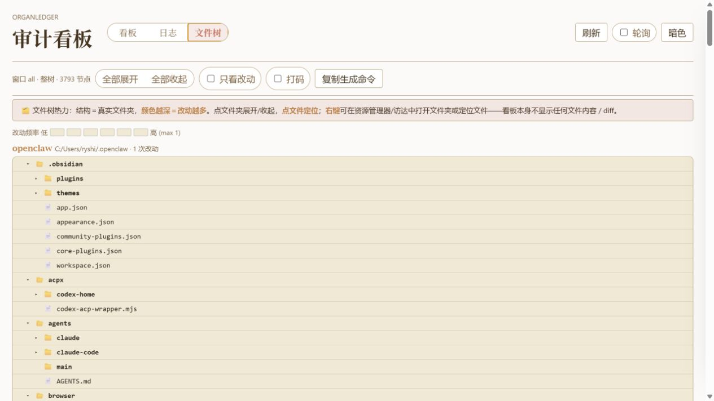
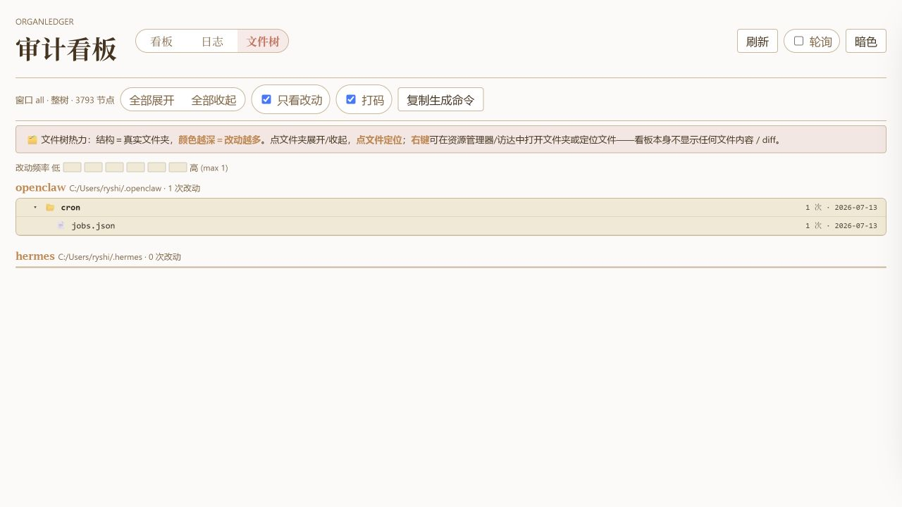

# 文件树热力页用户指南

文件树页把器官目录画成一棵可展开的树，并用颜色告诉你哪里最活跃。它适合回答一个看板和日志都不容易直接回答的问题：改动到底集中在系统的哪个区域？

如果看板页像风险队列，日志页像时间线，那么文件树页就是一张地图。你不用先打开每个文件，只要看颜色深浅，就能判断哪些目录最近被频繁触碰。

## 1. 进入文件树

点击顶部“文件树”。页面会按系统分组展示器官目录，通常会看到 OpenClaw、Hermes 等各自的树。

你可以这样读这张图：

- 文件夹层级保留真实结构，方便和本机文件管理器对应。
- 颜色越深，说明这一行或它下面的文件改动越多。
- 右侧数字显示改动次数和最近变化日期。
- 文件夹可以展开或收起，先看大目录，再逐层下钻。

这个设计的目的，是让用户先看到“热点在哪里”，而不是一上来面对长长的文件列表。

## 2. 用控件整理视野

文件树顶部的控件帮助你在“全景”和“聚焦”之间切换：

- **全部展开**：适合快速扫完整体结构。
- **全部收起**：适合回到高层目录，看哪些大区最热。
- **只看改动**：隐藏没有变化的条目，只保留真正发生过变化的区域。
- **打码**：把敏感名称显示为 `•••`，适合截图或分享。
- **复制生成命令**：复制当前文件树快照的生成命令。

“只看改动”适合排查，“打码”适合展示。两者一起用时，可以在不暴露具体敏感路径的情况下，说明改动热点分布。

## 3. 从地图跳到本机文件

当你看到某个文件或目录很活跃，可以在文件树里定位它。这个功能的目的不是在看板里读取内容，而是帮你快速跳回本机环境。

典型使用方式：

- 先在文件树里找到颜色较深的文件或目录。
- 点击或右键，在资源管理器 / 访达中打开文件夹或定位文件。
- 再用你熟悉的编辑器、git 或 Coding Agent 查看真实内容。

OrganLedger 在这里扮演“导航仪”，而不是“文件内容浏览器”。这样既能帮你快速找到位置，也避免看板直接暴露敏感正文。

## 4. 为什么需要打码

文件树默认展示真实文件名，因为用户需要用它定位本机文件。但在演示、截图或发给别人看时，路径名本身可能透露敏感信息。

打码功能就是为这个场景准备的：它保留热度和层级感，但隐藏具体名称。这样别人能看懂“哪里变多了”，却不会看到不该公开的文件名。

打码后不适合继续定位文件。如果你要回到本机查看内容，请关闭打码后再操作。

## 5. 推荐排查路径

遇到异常时，可以按这个顺序使用文件树：

1. 先看完整树，找颜色最深的大目录。
2. 展开热点目录，看是单个文件异常活跃，还是整个子树都在变化。
3. 打开“只看改动”，去掉无关条目。
4. 需要截图沟通时打开“打码”。
5. 需要判断真实内容时，定位到本机文件，再交给编辑器、git 或 Coding Agent。
6. 如果发现某个热点对应具体风险，再回到看板页打开变更详情。

文件树页的价值，是把“很多零散路径”变成“可以一眼看懂的改动地图”。
