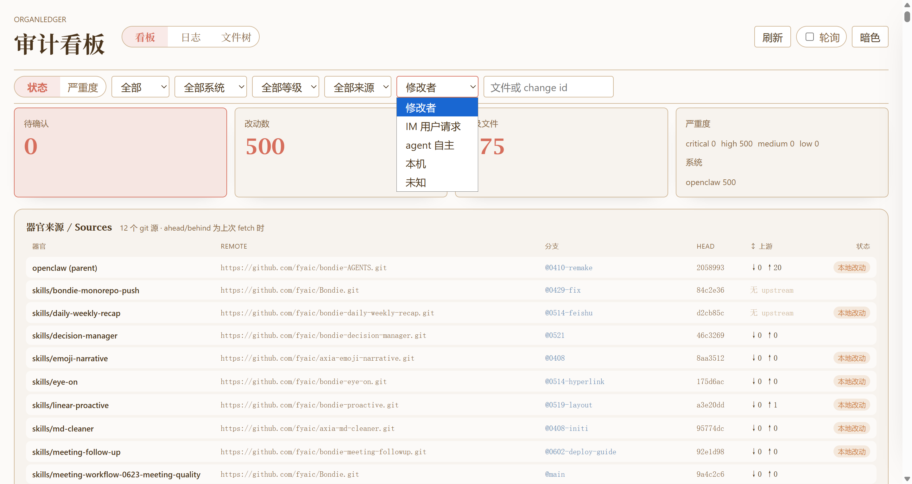

# OrganLedger 用户使用指南

OrganLedger 用来回答一个很朴素的问题：Agent 改了自己的技能、任务、记忆或流程以后，用户怎么知道发生了什么、风险在哪里、下一步该怎么处理？

它不是另一个 Agent，也不是编辑器插件，而是一个旁挂的“变更审计台”。OpenClaw、Hermes 或其他 Agent 系统继续工作；OrganLedger 负责把它们对关键器官文件的改动记录下来，整理成可读的看板、日志和文件树。

## 你可以用它做什么

- 看到最近有哪些器官文件被改动。
- 快速发现高风险改动、删除操作或待确认事项。
- 理解某个改动来自本地修改、上游更新，还是某个已接入的外部请求。
- 复盘某一天发生了什么，而不是翻散落的日志。
- 找到最活跃的目录和文件，再回到本机工具里进一步查看真实内容。
- 在需要时复制命令或简报，把问题交给终端或 Coding Agent 深入处理。

OrganLedger 的设计重点不是“替你猜真相”，而是“把能确认的证据摆清楚”。能验证来源时就标来源；能归因主使时就显示主使；不能证明的部分会明确说未知或未验证。

## 打开看板

日常使用通常只需要启动看板：

```bash
organledger dashboard
```

首次安装或重新配置时，再按项目 README 运行初始化、守护进程和预热命令。看板打开后，你会看到三个主页面：看板、日志、文件树。



这三个页面各自承担不同角色：

- 看板：处理“现在有没有值得我关注的改动”。
- 日志：处理“某一天到底发生了什么”。
- 文件树：处理“改动集中在哪些目录或文件”。

## 推荐阅读顺序

第一次打开时，可以按这个顺序看：

1. 先看“看板”页的概览数字和风险卡片，判断有没有待处理事项。
2. 点开某条变更，查看它的来源、主使、时间、路径和建议动作。
3. 切到“日志”页，用自然语言按日期复盘近期变更。
4. 切到“文件树”页，看哪些区域改动最频繁。
5. 如果某条记录需要深入判断，再复制简报给 Coding Agent，或回到本机 git / 编辑器查看真实 diff。

这个流程的核心是从“整体风险”走到“具体证据”，而不是一开始就陷入文件细节。

## 几个核心概念

**变更记录**：OrganLedger 把每次器官文件变化整理成一条记录。记录里包含文件路径、操作类型、时间、严重度、状态和相关证据。

**来源**：说明这个器官或改动来自哪里，例如哪个 remote、哪个分支、哪个 commit。来源是为了回答“它从哪来”，不等于回答“是谁改的”。

**主使**：说明这次改动可能由谁的请求触发，例如 IM 用户、本机、Agent 自主行为或未知。只有接入了对应入口并满足认证条件时，主使才会显示为已认证；否则不会硬猜。

**只读看板**：看板负责展示和组织证据，不直接修改账本或 git。需要批准、拒绝或回滚时，页面会给出可复制命令，由用户在终端中执行。

## 页面级说明

本目录里还有三份更具体的页面说明：

- [`01-audit-board.md`](01-audit-board.md)：如何看风险、来源、主使和单条变更详情。
- [`02-activity-log.md`](02-activity-log.md)：如何按日期复盘改动。
- [`03-file-tree.md`](03-file-tree.md)：如何看改动热点、打码和定位文件。

> 截图来自本机真实账本，数字和记录会随你的环境变化。阅读时重点看页面传达的功能和判断方式，不必把示例中的数量当成固定结果。
